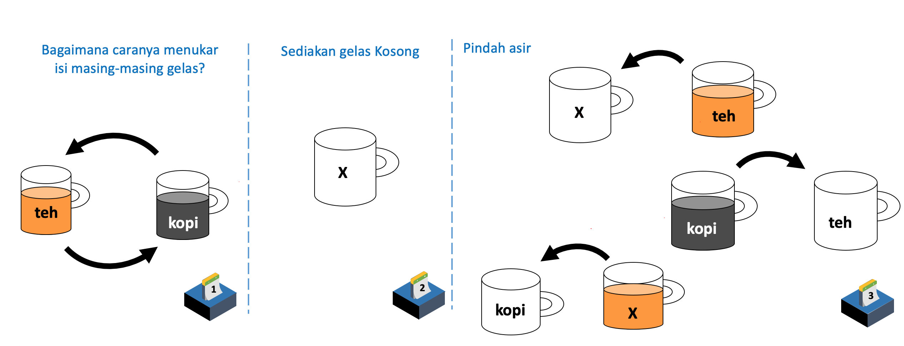
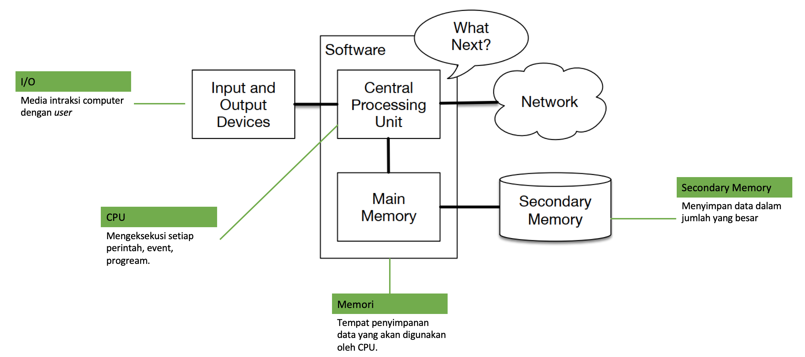

# Modul Kuliah Minggu Ke 1 - Algoritma Pemrograman

Dosen Pengampu : **Arif Wicaksono Septyanto**`<br>`

Tujuan Belajar :

- Mahasiswa mampu menjelaskan prinsip dasar algoritme dan pemrograman dengan Python

## Konsep Dasar Algoritma Pemrograman

**Algoritma** adalah suatu urutan langkah-langkah yang ditentukan untuk menyelesaikan suatu masalah. Algoritma membantu kita menyelesaikan masalah dengan cara yang sistematis dan terstruktur. Dalam dunia teknologi informasi, algoritma sering digunakan untuk menyelesaikan masalah-masalah yang berkaitan dengan pengolahan data dan pemrograman. Algoritma juga bisa diterapkan dalam berbagai bidang lain, seperti matematika, ekonomi, dan biologi. Penting untuk dicatat bahwa algoritma harus spesifik, tepat, dan efisien dalam menyelesaikan masalah tertentu.

**Algoritma pemrograman** adalah suatu serangkaian langkah logika yang diterapkan dalam pemrograman untuk menyelesaikan suatu masalah. Algoritma pemrograman bertujuan untuk memberikan solusi yang tepat, efisien, dan terstruktur untuk masalah-masalah yang ada. Algoritma pemrograman dapat diterapkan dalam berbagai jenis bahasa pemrograman, seperti C, Python, Java, dan lain-lain.

Setiap algoritma pemrograman harus spesifik dan jelas, sehingga dapat dipahami oleh pemrogram dan mudah diterapkan dalam pembuatan kode. Algoritma pemrograman juga harus memenuhi beberapa kriteria, seperti memiliki input dan output yang jelas, dan harus dapat menyelesaikan masalah dalam waktu yang ditentukan.

## Syarat Algoritma

Ada beberapa syarat yang harus dipenuhi oleh sebuah algoritma, antara lain:

1. Terdefinisi: Algoritma harus memiliki definisi yang jelas dan spesifik, sehingga memudahkan untuk mengimplementasikannya dalam kode.
2. Finite: Algoritma harus memiliki jumlah langkah yang terbatas dan tidak berkesinambungan, sehingga memastikan bahwa algoritma akan selesai dalam waktu yang ditentukan.
3. Efektif: Algoritma harus dapat menyelesaikan masalah dengan cara yang efisien dan tepat.
4. Input/Output: Algoritma harus memiliki input dan output yang jelas, sehingga memudahkan untuk memahami proses yang terjadi.
5. Unambiguous: Algoritma harus memiliki instruksi yang jelas dan tidak ambigu, sehingga memastikan bahwa algoritma dapat diterapkan dengan benar.
6. General: Algoritma harus dapat diterapkan untuk menyelesaikan masalah-masalah yang berbeda dengan cara yang sama.
7. Optimal: Algoritma harus dapat menyelesaikan masalah dengan cara yang paling efisien dan optimal.

Dengan memenuhi syarat-syarat ini, algoritma akan dapat memastikan bahwa masalah dapat diselesaikan dengan cara yang tepat, efisien, dan mudah dipahami.

## Tahapan membuat algoritma

Berikut adalah beberapa tahapan umum dalam pembuatan algoritma:

1. Identifikasi masalah: Langkah pertama dalam pembuatan algoritma adalah mengidentifikasi masalah yang ingin diselesaikan.
2. Analisis masalah: Setelah masalah teridentifikasi, langkah selanjutnya adalah melakukan analisis terhadap masalah tersebut untuk memahami secara detail apa yang harus dilakukan untuk menyelesaikan masalah tersebut.
3. Desain algoritma: Langkah selanjutnya adalah merancang algoritma dengan menentukan urutan langkah-langkah yang diperlukan untuk menyelesaikan masalah.
4. Implementasi: Setelah algoritma dirancang, langkah selanjutnya adalah mengimplementasikan algoritma dalam kode program.
5. Verifikasi: Langkah selanjutnya adalah memverifikasi bahwa algoritma bekerja dengan benar dan menyelesaikan masalah sesuai dengan yang diharapkan.
6. Debugging: Jika ada kesalahan dalam algoritma, langkah selanjutnya adalah melakukan debugging untuk memperbaiki kesalahan tersebut.
7. Evaluasi: Langkah terakhir adalah melakukan evaluasi terhadap algoritma untuk memastikan bahwa algoritma bekerja dengan efisien dan memenuhi standar yang ditetapkan.

Dengan mengikuti tahapan-tahapan ini, sebuah algoritma dapat dibuat dengan benar dan memenuhi syarat yang ditetapkan.

contoh algoritma



dalam bahasa pemrograman python

```python{.line-numbers}
#anggap volume gelas 800ml
kopi = 700 #700ml
teh = 600 #600ml
gelas_kosong = 0
print(kopi , teh , gelas_kosong)
```

```python{.line-numbers}
teh, kopi = kopi, teh
print(teh, kopi, gelas_kosong)
```

```python{.line-numbers}
gelas_kosong = teh
teh = kopi
kopi = gelas_kosong
print(teh , kopi, gelas_kosong)
```

## Arsitektur komputer



Arsitektur Kompter terrdiri dari beberapa komponen utama, yaitu:

1. Prosesor (CPU): Ini adalah otak komputer yang melakukan semua tugas pemrosesan dan pengambilan keputusan.
2. Memori (RAM): Ini adalah bagian dari komputer yang digunakan untuk menyimpan data sementara selama komputer berfungsi.
3. Storage (Hard Drive / SSD): Ini adalah bagian dari komputer yang digunakan untuk menyimpan data dan aplikasi secara permanen.
4. Motherboard: Ini adalah bagian dari komputer yang menghubungkan semua komponen bersama.
5. Input/Output Devices (I/O Devices): Ini adalah perangkat yang digunakan untuk mengirimkan data masuk ke komputer atau mengeluarkan data dari komputer, seperti keyboard, mouse, monitor, printer, dll.
6. Peripheral Devices: Ini adalah perangkat tambahan yang terhubung ke komputer, seperti scanner, web cam, speaker, dll.
7. Power Supply Unit (PSU): Ini adalah bagian dari komputer yang menyediakan listrik ke semua komponen komputer.

Dengan mengetahui komponen-komponen ini, Anda akan memahami bagaimana sebuah komputer berfungsi dan bagaimana komponen-komponen tersebut bekerja bersama-sama untuk menjalankan tugas yang diberikan kepada komputer.

## Ciri- ciri algoritma

Berikut adalah beberapa ciri-ciri dari sebuah algoritma:

1. Unambiguous: Algoritma harus memberikan hasil yang jelas dan tidak ambigu.
2. Definite: Algoritma harus memiliki setiap langkah yang jelas dan terdefinisi.
3. Finite: Algoritma harus memiliki jumlah langkah yang terbatas dan tidak berkesinambungan.
4. Input: Algoritma harus memiliki satu atau lebih masukan.
5. Output: Algoritma harus memiliki satu atau lebih keluaran.
6. Effective: Algoritma harus dapat dilakukan dengan cara yang efisien dan efektif.
7. General: Algoritma harus dapat diterapkan pada berbagai kasus yang berbeda.
8. Independent: Algoritma harus memiliki kemampuan untuk berjalan tanpa tergantung pada sistem atau perangkat tertentu.

Dengan memenuhi ciri-ciri ini, sebuah algoritma akan dapat memecahkan masalah secara efisien dan dapat diterapkan pada berbagai kasus yang berbeda.

## Pengantar Python

Python adalah bahasa pemrograman tingkat tinggi yang mengutamakan keterbacaan kode dan memiliki sintaks yang sederhana dan mudah dipahami. Python dikembangkan pada tahun 1980-an oleh Guido van Rossum dan pertama kali rilis pada tahun 1989. Python memiliki berbagai fitur seperti dinamis, multi-paradigma, dan interpretatif, membuatnya menjadi bahasa pemrograman yang sangat fleksibel dan bisa digunakan untuk berbagai macam proyek, seperti pemrograman web, aplikasi desktop, analisis data, dan lain-lain. Python juga memiliki ekosistem yang kuat dan aktif, dengan banyak library dan komunitas yang membantu programmer untuk membuat aplikasi yang lebih baik.

Ada beberapa cara untuk menjalankan bahasa pemrograman Python:

1. Menggunakan Interpreter Python: Anda dapat membuka interpreter Python di komputer Anda dan mengetikkan kode Python pada prompt. Anda dapat menjalankan setiap baris kode secara individual dan melihat hasilnya pada layar.
2. Menjalankan File Python: Anda dapat menulis kode Python dalam file dengan ekstensi .py, lalu menjalankan file tersebut menggunakan interpreter Python.
3. Menjalankan File Python dari Command Line: Anda dapat membuka Command Prompt atau Terminal dan mengetikkan perintah "python namafile.py" untuk menjalankan file Python.
4. Menjalankan File Python dalam Integrated Development Environment (IDE): Anda dapat menggunakan IDE seperti PyCharm, IDLE, VS code atau Eclipse dengan plugin Python untuk menulis, menguji, dan menjalankan kode Python.
5. Menjalankan Python dalam Jupyter Notebook: Anda dapat menjalankan Python dalam lingkungan Jupyter Notebook, yang memungkinkan Anda untuk menulis kode, menjalankan kode, dan melihat hasilnya secara interaktif dalam halaman web.

## Perbedaan pemrograman interpreter dan compiler

Pemrograman interpreter dan compiler adalah dua pendekatan berbeda dalam menjalankan dan menerjemahkan kode bahasa pemrograman ke dalam instruksi yang dapat dimengerti oleh komputer. Berikut adalah perbedaan utama antara keduanya:

1. Interpreter:

   - Penerjemahan Langsung: Interpreter menerjemahkan dan menjalankan kode baris per baris saat kode tersebut dieksekusi.
   - Penjalanan Secara Interaktif: Interpreter memungkinkan interaksi langsung dengan kode. Setelah satu baris kode dieksekusi, hasilnya langsung ditampilkan.
   - Kecepatan Eksekusi: Kode yang dieksekusi dengan interpreter umumnya lebih lambat dibandingkan dengan kode yang dikompilasi.
   - Contoh Bahasa: Python, Ruby, JavaScript.
2. Compiler:

   - Penerjemahan Sebelum Eksekusi: Compiler menerjemahkan seluruh kode program ke dalam bentuk kode biner atau kode bahasa lain sebelum program dijalankan.
   - Eksekusi Setelah Kompilasi: Setelah proses kompilasi selesai, hasilnya adalah file eksekusi yang bisa dijalankan tanpa perlu penerjemahan ulang.
   - Kecepatan Eksekusi: Kode yang dikompilasi cenderung berjalan lebih cepat karena sudah diubah menjadi kode mesin.
   - Contoh Bahasa: C, C++, Java.

Dalam rangkaian kerja pemrograman, interpreter lebih fleksibel dan memudahkan eksperimen serta debugging karena hasil eksekusi langsung dapat dilihat. Compiler, di sisi lain, menghasilkan eksekusi yang lebih cepat tetapi mungkin memerlukan lebih banyak waktu untuk melakukan proses kompilasi sebelum kode bisa dijalankan.

Seringkali, bahasa pemrograman dapat memiliki sifat hibrida di mana beberapa bahagian kode dijalankan melalui interpreter (misalnya, Python) dan beberapa bahagian dikompilasi sebelum eksekusi (misalnya, Java).

## Instalasi Python

Untuk menginstal Python, berikut adalah langkah-langkah yang dapat Anda ikuti:

1. Unduh Python: Unduh versi terbaru Python dari situs resmi Python (https://www.python.org/downloads/). Pastikan untuk mengunduh versi yang sesuai dengan sistem operasi Anda (Windows, MacOS, atau Linux).
2. Jalankan Instalasi: Setelah mengunduh file instalasi, jalankan file tersebut seperti cara menginstal software pada umumnya. Ikuti instruksi yang diberikan oleh wizard instalasi.
3. Verifikasi Instalasi: Setelah instalasi selesai, buka Command Prompt atau Terminal dan ketikkan "python" untuk memverifikasi instalasi Python. Jika instalasi berhasil, Anda akan melihat prompt Python dan dapat mulai menulis dan menjalankan kode Python.
4. Konfigurasi PATH: Jika Anda mengalami masalah dalam menjalankan Python, pastikan bahwa direktori Python terinstall sudah dalam PATH sistem. Ini memungkinkan Anda menjalankan Python dari mana saja dalam sistem Anda.

Itu adalah langkah-langkah dasar untuk menginstal Python. Jika Anda memiliki masalah atau kendala, Anda dapat mencari bantuan di situs web Python atau komunitas Python.

## Menggunakan Mini Conda dalam Visual Studio Code

Berikut adalah langkah-langkah untuk menginstall Mini conda dan mengintegrasikannya dengan Visual Studio Code:

1. Unduh Mini conda: Unduh Mini conda dari situs resmi Anaconda (https://docs.conda.io/en/latest/miniconda.html). Pilih versi yang sesuai dengan sistem operasi Anda (Windows, MacOS, atau Linux).
2. Jalankan Instalasi: Setelah mengunduh file instalasi, jalankan file tersebut seperti cara menginstal software pada umumnya. Ikuti instruksi yang diberikan oleh wizard instalasi.
3. Verifikasi Instalasi: Setelah instalasi selesai, buka Command Prompt atau Terminal dan ketikkan "conda" untuk memverifikasi instalasi Mini conda. Jika instalasi berhasil, Anda akan melihat daftar perintah conda.
4. Instalasi Ekstensi Visual Studio Code: Buka Visual Studio Code, klik ikon Extensions di bagian kiri, lalu cari dan instal ekstensi "Python" dan "Conda".
5. Konfigurasi Ekstensi Python: Buka pengaturan Visual Studio Code (File > Preferences > Settings), cari "python.condaPath", dan sesuaikan dengan direktori instalasi Mini conda Anda.
6. Buat Environment Baru: Buka Terminal Visual Studio Code (View > Terminal), ketik "conda create --name namaenv python=versi", lalu tekan Enter. Ini akan membuat environment baru menggunakan Python yang spesifik.
7. Aktifkan Environment: Ketik "conda activate namaenv" pada Terminal Visual Studio Code, lalu tekan Enter. Ini akan mengaktifkan environment baru yang Anda buat.

## Perbedaan Intepreter dan compailer

Intepreter dan compiler adalah dua jenis penerjemah bahasa pemrograman yang berbeda. Berikut adalah perbedaan utama antara keduanya:

1. Cara Kerja: Compiler mengubah kode sumber menjadi bahasa mesin sekaligus, sedangkan interpreter mengeksekusi kode sumber baris demi baris.
2. Output: Compiler menghasilkan file biner yang dapat dibuka dan dieksekusi tanpa membutuhkan bahasa pemrograman asli, sedangkan interpreter tidak menghasilkan file biner tetapi hanya mengeksekusi kode secara langsung.
3. Kecepatan Eksekusi: Umumnya, file biner yang dihasilkan compiler lebih cepat dibandingkan dengan eksekusi interpreter, karena sudah diterjemahkan menjadi bahasa mesin.
4. Debugging: Interpreter memungkinkan debugging kode secara interaktif, karena mengeksekusi kode baris demi baris. Sementara, debugging pada file biner yang dihasilkan compiler lebih sulit dilakukan.
5. Portabilitas: File biner yang dihasilkan compiler hanya dapat dieksekusi pada sistem operasi yang sesuai, sedangkan interpreter dapat bekerja pada berbagai sistem operasi.

Itulah perbedaan utama antara interpreter dan compiler. Pilihan antara kedua jenis penerjemah bergantung pada kebutuhan dan preferensi pemrograman Anda. Beberapa bahasa pemrograman seperti Python menggunakan interpreter, sementara bahasa pemrograman seperti C dan C++ menggunakan compiler.

## Menjalankan File Python Pertama

Berikut adalah langkah-langkah untuk menjalankan file Python pertama Anda:

Buka aplikasi teks editor, seperti Notepad atau Visual Studio Code.

Tulis kode Python Anda. Misalnya, untuk mencetak pesan "Hello, World!" ke console, Anda dapat menulis kode berikut:

```python
print("Hello, World!")
```

3. Simpan file dengan ekstensi .py. Misalnya, "hello_world.py".
4. Buka Command Prompt atau Terminal.
5. Arahkan ke direktori tempat file Python Anda disimpan dengan mengetikkan perintah cd seperti cd Documents/python.
6. Jalankan file Python dengan mengetikkan python nama_file.py, misalnya python hello_world.py.
7. Setelah file dijalankan, Anda akan melihat pesan "Hello, World!" ditampilkan pada console.

Itu adalah langkah-langkah untuk menjalankan file Python pertama Anda. Pastikan Anda memiliki aplikasi Python yang diinstal pada komputer Anda sebelum menjalankan file Python.


```python{.line-numbers}
#anggap volume gelas 800ml
kopi = 700 #700ml
teh = 600 #600ml
gelas_kosong = 0
print(kopi , teh , gelas_kosong)
```
hasil

