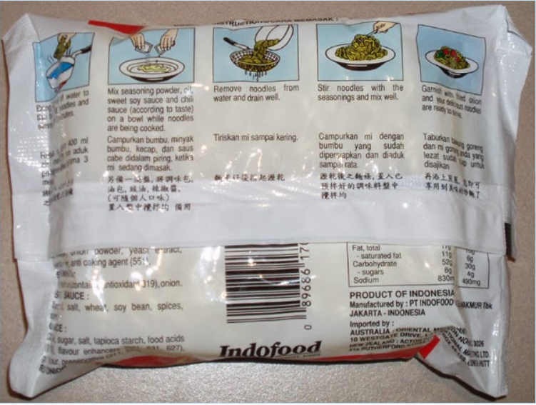

# Modul Kuliah Minggu Ke 2 - Konsep Dasar Algoritma dan Pemrograman

Dosen Pengampu : **Arif Wicaksono Septyanto** 

Tujuan Belajar :
- Mahasiswa mampu menggunakan algoritme, diagram alir, dan pseudocode
 I/O yang melibatkan variabel dan ekspresi dan mengimplementasikannya dengan Python.

## 1. Pengertian dan Sejarah Algoritma

Algoritma adalah urutan instruksi logis dan matematis yang dirancang untuk menyelesaikan suatu masalah atau tugas secara efektif dan efisien. Algoritma seringkali diwakili dalam bentuk diagram alir atau pseudocode.

Sejarah algoritma dapat dilacak kembali ke awal peradaban manusia ketika mereka mengembangkan cara untuk memecahkan masalah dan menjalankan tugas tertentu. Misalnya, bangsa Mesir Kuno menggunakan algoritma untuk membangun piramida, sedangkan bangsa Yunani Kuno menggunakan algoritma untuk menyelesaikan masalah geometri.

Kata "algoritma" sendiri berasal dari nama seorang matematikawan Muslim terkenal dari abad ke-9, Muhammad ibn Musa al-Khwarizmi, yang dikenal sebagai "Bapak Aljabar". Al-Khwarizmi dikenal karena karyanya dalam mengembangkan sistem bilangan Hindu-Arab dan memperkenalkan algoritma dalam matematika.

Pengertian algoritma adalah prosedur sistematis dan terstruktur yang digunakan untuk menyelesaikan suatu masalah atau tugas tertentu. Algoritma umumnya dibuat dengan menggunakan bahasa pemrograman atau notasi matematika, dan dapat diimplementasikan dalam berbagai jenis aplikasi dan program.

Kemampuan untuk membuat dan memahami algoritma sangat penting dalam dunia komputasi dan teknologi informasi, karena algoritma merupakan dasar dari semua program dan sistem komputer yang digunakan di seluruh dunia. Dalam dunia bisnis, algoritma digunakan dalam analisis data dan pengambilan keputusan, sementara dalam ilmu pengetahuan dan teknik, algoritma digunakan untuk memodelkan dan memecahkan masalah yang kompleks.

berikut adalah contoh sederhana algoritma tanpa menggunakan bahasa pemrograman, tetapi menggunakan langkah-langkah dalam bentuk instruksi berdasarkan masalah yang dihadapi:

Algoritma Membuat Mie Instan 

1. Siapkan mie instan, panci/wajan, mangkok, sendok dan garpu, dan air secukupnya. 
2. Masukkan air ke panci atau wajan. 
3. Nyalakan kompor dan didihkan air.
4. Sambil menunggu air mendidih, buka bungkus mie, buka bungkus bumbu dan tuangkan ke mangkok. 
5. Jika air sudah mendidih, masukkan mie. 
6. Tunggu mie hingga berubah tekstur menjadi kenyal. 
7. Sesekali diaduk. 
8. Jika mie sudah kenyal, matikan kompor dan tuang mie ke mangkok. 
9. Aduk mie hingga bumbu merata. 
10. Mie siap disantap. 

  
  
<strong>Gambar 2. Flowchart Membuat Mie</strong>

Penjelasan Flowchart :

1. "Mulai" (Simbol Terminator). Menunjukkan awal dari Flowchart. 
2. "Siapkan mie instan, panci/wajan, mangkok, sendok dan garpu, dan air secukupnya." (Simbol Preparation). Menyatakan langkah persiapan untuk melakukan langkah berikutnya. Disini semua alat dan bahan disiapkan sebelum melakukan langkah berikutnya yaitu merebus mie. 
3. "Masukkan Air" (Simbol Input/Output). Ini menyatakan langkah dimana kita melakukan input/masukkan. Di sini yang kita input adalah air. 
4. "Nyalakan Kompor dan Didihkan Air" (Simbol Process). Menyatakan langkah yang berisi aksi dan proses. Aksi disini adalah menyalakan kompor dan proses disini yaitu mendidihkan air.
5. "Kemudian Tunggu Mendidih" (Simbol Delay). Menyatakan waktu tunggu atau delay. Di sini waktu tunggu yang dimaksud adalah menunggu air mendidih. 
6. Kemudian "Buka Bungkus Mie...mangkok" (Simbol Process). Saya hubungkan dengan garis putus-putus yang menandakan langkah ini bisa dilakukan sambil menunggu waktu delay. Di sini kita lakukan sambil menunggu air mendidih. 
7. Kemudian Simbol Decision dengan teks "Mendidih?". Digunakan untuk mengecek kondisi apakah air sudah mendidih. 
8. Jika air mendidih, "Masukkan Mie ke Panci" (Simbol Input/Output). Menandakan langkah yang memerlukan input. Di sini kita input mie ke panci.
9. Kemudian "Tunggu..." (Simbol Delay). Ini menyatakan kita harus menunggu sampai mie menjadi kenyal. 
10. "Sesekali diaduk" (Simbol Process). Berisi aksi berupa mengaduk. 
11. Simbol Decision lagi untuk mengecek apakah "Mie Sudah Kenyal?". Jika mie sudah kenyal, matikan kompor dan tuang ke mangkok. Jika belum, kembali menunggu dan sesekali diaduk. 
12. Selanjutnya Simbol Process "Aduk mie hingga bumbu merata". Menyatakan aksi mengaduk mie. 
13. Lalu Simbol Input/Output. Disini kita nyatakan output dari proses memasak mie yaitu "Mie siap santap". 
14. "Selesai" (Simbol Terminator). Menyatakan akhir dari proses atau algoritma.

  
  
<strong>Gambar 1. Algoritma Pada Mie Goreng</strong>

*Berikut adalah beberapa ciri-ciri algoritma yang baik:*

- Input yang Jelas: Algoritma harus memiliki langkah-langkah yang jelas untuk memahami input yang diberikan. Input harus didefinisikan dengan baik sehingga algoritma dapat menghasilkan hasil yang diharapkan.
- Langkah-langkah Terstruktur: Algoritma harus terdiri dari langkah-langkah yang terstruktur dan terorganisir dengan baik. Setiap langkah harus mengikuti secara logis dari langkah sebelumnya dan mengarah ke langkah berikutnya.
- Tinjauan Umum yang Jelas: Algoritma harus memiliki pandangan umum tentang apa yang ingin dicapai. Ini membantu untuk memahami tujuan dan tujuan dari algoritma.
- Efisiensi: Algoritma yang baik harus efisien dalam penggunaan sumber daya seperti waktu dan memori. Ini berarti algoritma dapat menyelesaikan tugas dengan cepat dan menggunakan jumlah sumber daya yang wajar.
- Mudah Dipahami: Algoritma harus mudah dipahami oleh orang lain yang membaca atau memeriksa kode. Langkah-langkah harus ditulis dengan jelas dan dapat dimengerti tanpa ambigu.
- Solusi yang Benar: Algoritma harus menghasilkan hasil yang benar dan akurat sesuai dengan masalah yang harus dipecahkan. Algoritma yang menghasilkan hasil yang salah atau tidak konsisten tidak efektif.
- Teruji dan Terbukti: Algoritma yang baik harus telah diuji secara menyeluruh untuk memastikan bahwa ia berfungsi sesuai yang diharapkan dalam berbagai situasi.
- Modularitas: Algoritma yang baik dapat dibagi menjadi bagian-bagian yang lebih kecil atau modul yang dapat dikelola secara terpisah. Ini memudahkan perawatan, pengembangan, dan perbaikan di masa mendatang.
- Dokumentasi yang Baik: Algoritma harus dijelaskan dengan baik melalui komentar atau dokumentasi yang menjelaskan tujuan, langkah-langkah, dan bagaimana algoritma bekerja.
- Fleksibilitas: Algoritma yang baik harus dapat digunakan untuk berbagai kasus dan dapat dengan mudah diadaptasi untuk menyelesaikan masalah yang serupa.
- Sederhana dan Elegan: Algoritma yang baik cenderung lebih sederhana dan elegan. Ini menghindari kebingungan dan meningkatkan kemampuan untuk memahami serta mengelola algoritma.

Memiliki algoritma yang memenuhi ciri-ciri ini akan membantu dalam mengembangkan solusi yang efektif dan efisien untuk masalah yang dihadapi.

## 2. Penyajian Algoritma

Penyajian algoritma adalah cara untuk mengkomunikasikan langkah-langkah yang diperlukan untuk menyelesaikan suatu tugas atau masalah secara jelas dan terstruktur. Ada beberapa cara untuk menyajikan algoritma, tergantung pada konteks dan audiens yang dituju. Berikut beberapa cara umum untuk menyajikan algoritma:

1. Pseudocode (Pseudokode): Pseudokode adalah bahasa yang mirip dengan bahasa pemrograman, tetapi lebih mirip dengan bahasa manusia. Ini digunakan untuk mendeskripsikan algoritma secara naratif dan tidak terkait dengan sintaksis bahasa pemrograman tertentu. Ini memungkinkan untuk mengkomunikasikan ide dan langkah-langkah algoritma dengan mudah kepada orang lain.
2. Diagram Alir (Flowchart): Diagram alir adalah representasi grafis langkah-langkah algoritma dengan menggunakan bentuk-bentuk geometris dan panah untuk menggambarkan aliran logika. Diagram alir sangat bermanfaat dalam memvisualisasikan urutan langkah dan pengambilan keputusan dalam algoritma.
3. Deskripsi Teks: Algoritma juga dapat dijelaskan dalam bentuk teks yang rinci. Ini adalah cara sederhana untuk menulis langkah-langkah algoritma secara berurutan dengan kalimat-kalimat yang jelas dan deskriptif.
4. Model Matematika: Untuk masalah yang melibatkan komputasi matematika atau analisis numerik, seringkali algoritma dijelaskan dalam bentuk persamaan matematika atau model matematika.
5. Contoh Kode Pemrograman: Jika tujuannya adalah untuk mengimplementasikan algoritma dalam suatu bahasa pemrograman, Anda dapat menyajikan algoritma dengan memberikan contoh kode pemrograman yang mendemonstrasikan langkah-langkah algoritma.
6. Diagram Blok: Diagram blok adalah cara lain untuk memvisualisasikan algoritma dengan menggunakan blok-blok untuk mewakili langkah-langkah dan menghubungkannya dengan panah untuk mengindikasikan aliran algoritma.
7. Animasi: Dalam beberapa kasus, seperti algoritma yang berhubungan dengan komputer grafis atau simulasi, animasi dapat digunakan untuk mengilustrasikan cara algoritma bekerja secara visual.

Pilihan penyajian algoritma tergantung pada kebutuhan dan preferensi Anda, serta cara terbaik untuk mengkomunikasikan algoritma kepada audiens yang dituju. Tujuan utamanya adalah untuk membuat algoritma menjadi lebih mudah dipahami dan diikuti oleh siapa pun yang membaca atau menggunakan algoritma tersebut.